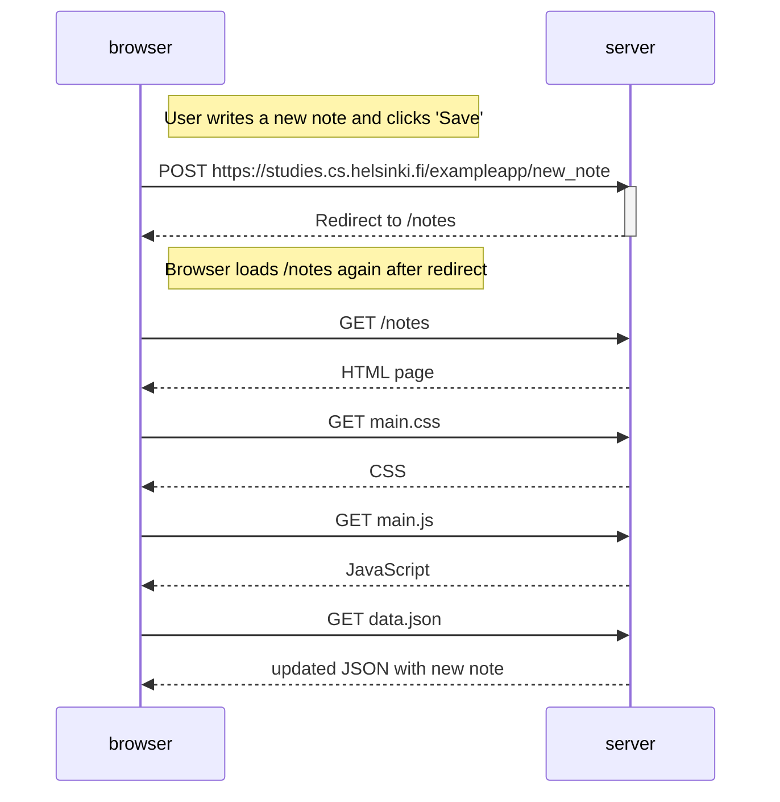

```mermaid
    sequenceDiagram
        participant browser
        participant server
    
        Note right of browser: User writes a new note and clicks 'Save'
    
        browser->>server: POST https://studies.cs.helsinki.fi/exampleapp/new_note
        activate server
        server-->>browser: Redirect to /notes
        deactivate server
    
        Note right of browser: Browser loads /notes again after redirect
    
        browser->>server: GET /notes
        server-->>browser: HTML page
        browser->>server: GET main.css
        server-->>browser: CSS
        browser->>server: GET main.js
        server-->>browser: JavaScript
        browser->>server: GET data.json
        server-->>browser: updated JSON with new note
```
